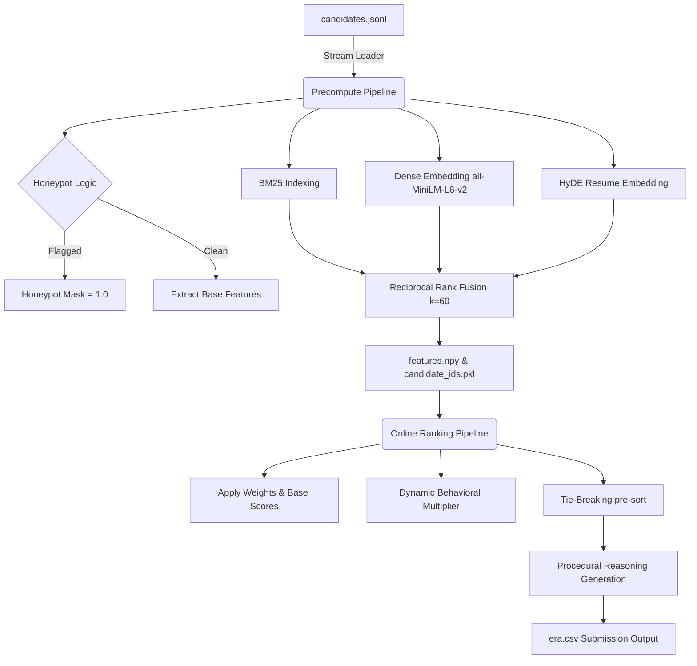

<p align="center">
  
</p>

<p align="center">
  
  
  
  
  
</p>

<h1 align="center">Redrob Intelligent Candidate Ranker</h1>
<p align="center"><i>A modular, CPU-optimized, hybrid semantic & heuristic ranking pipeline — Team ERA</i></p>

<p align="center">
  
</p>

---

## Table of Contents

- [Overview](#overview)
- [Why This Approach](#why-this-approach)
- [Architecture](#architecture)
- [Repository Structure](#repository-structure)
- [Module Deep-Dive](#module-deep-dive)
- [Scoring Model](#scoring-model)
- [Anti-Gaming: Honeypot Defenses](#anti-gaming-honeypot-defenses)
- [Zero-Hallucination Reasoning Engine](#zero-hallucination-reasoning-engine)
- [Performance & Constraints](#performance--constraints)
- [Verification & Testing](#verification--testing)
- [Key Innovations](#key-innovations)
- [Tech Stack](#tech-stack)
- [References](#references)
- [Contributing](#contributing)

---

## Overview

The **Redrob Intelligent Candidate Ranker** ranks **100,000 candidate profiles** against a Senior AI Engineer job description — entirely **offline, CPU-only, and deterministic** — while explaining *why* each top candidate was ranked where they were, with zero hallucinated claims.

| Constraint | Target | Hackathon Limit |
|---|---|---|
| Latency | ≤ 2 minutes | ≤ 5 minutes |
| Memory | ≤ 3 GB RAM | ≤ 16 GB |
| Hardware | CPU-only | CPU-only |
| Network | Fully offline | `--network none` |
| Ordering | Deterministic, tie-broken by `candidate_id` | — |
| Honeypot trap rate (Top 100) | < 10% | Disqualification threshold |

---

## Why This Approach

Three failure modes motivated the design:

1. **Semantic search alone fails.** Transformer embeddings catch abstract similarity ("vector indexing" ≈ "similarity search") but miss domain constraints — e.g. ranking a keyword-stuffed junior candidate above a genuinely senior ML engineer.
2. **LLM APIs don't scale here.** Scoring 100K candidates with an LLM blows the 5-minute budget, needs network access, and produces reasoning that can't be audited or reproduced.
3. **Resume fraud is common.** Synthetic/gamed profiles show structural tells — overlapping employment dates, "expert" skills with 0 months tenure, technologies claimed before they existed.

**The fix:** combine a local bi-encoder (`all-MiniLM-L6-v2`) with a fast deterministic rule engine and a 36-rule structural fraud detector — so every score and every justification traces back to a verifiable fact in the profile.

---

## Architecture



**Two phases** keep the pipeline inside the 5-minute wall-clock budget:

| Phase | File | What it does |
|---|---|---|
| **Precomputation** | `precompute.py` | Streams JSONL line-by-line (memory peak < 4 GB); builds `all-MiniLM-L6-v2` embeddings; builds a vocabulary-pruned BM25 index; runs honeypot checks; saves feature matrices to disk. |
| **Online Ranking** | `rank.py` | Loads `features.npy` in < 1.5s; applies dynamic behavioral scoring; filters honeypots; writes top 100 to `era.csv` in under 15 seconds. |

---

## Repository Structure

```text
India-Runs-Hackathon/
├── artifacts/                    # Precomputed dense embeddings & temporal anchors
├── data/
│   └── embeddings/                # Local embeddings cache
│       ├── candidate_ids.json     # Candidate IDs matching matrix rows
│       └── embeddings.fp16.npz    # Compressed FP16 bi-encoder embeddings
├── config/
│   └── defaults.py                # Global env config & temporal anchoring
├── challenge/
│   ├── jd_config.py               # JD constants, thresholds & keyword taxonomy
│   ├── text_match.py              # Tokenizers, phrase counters, text cleaners
│   ├── company_matrix.py          # Company name → founding year mapping
│   ├── career_blurb.py            # Duplicate blurb fingerprinting
│   ├── availability.py            # Recency, activity & notice-period logic
│   ├── assessment.py              # Verified skill test scoring
│   ├── embeddings.py              # EmbeddingStore loader & cosine similarity
│   ├── semantic.py                # Pattern matching, TF-IDF fallback
│   ├── features.py                # Immutable CandidateIndex builder
│   ├── honeypot.py                # 36 fraud-detection rules
│   ├── rerank.py                  # Cross-encoder blending (opt-in)
│   └── redrob_ranker.py           # Primary pipeline, calibration, grounding
├── sandbox/
│   └── app.py                     # FastAPI page for interactive evaluation
├── scripts/                       # Precompute & audit helper tools
├── src/
│   ├── pipeline.py                 # Main CLI orchestrator
│   ├── data/                       # Memory-efficient JSONL generators
│   ├── features/                   # Extraction scripts
│   ├── ranking/                    # Scorer fusion & reasoning formatting
│   └── utils/                      # Loggers & clean tokenizers
├── Dockerfile                     # Network-free isolated build
├── Makefile                       # `make gameday` entrypoint
├── run_pipeline.py                # Root-level runner wrapper
└── era.csv                        # Output submission file
```

---

## Module Deep-Dive

<details>
<summary><b>defaults.py</b> — Runtime Configuration</summary>
<br>

Anchors all date-based logic to a fixed reference date (`_DEFAULT_REFERENCE_DATE = 2026-06-22`, overridable via `RANKING_REFERENCE_DATE`) so recency scoring is reproducible regardless of the day the pipeline is actually run.
</details>

<details>
<summary><b>jd_config.py</b> — Job Description Schema</summary>
<br>

Centralizes the vocabulary the entire pipeline scores against:
- **Title tiers:** `STRONG_TITLES` (e.g. Senior AI Engineer, Search Engineer) → `GOOD_TITLES` (adjacent roles) → `WEAK_TITLES` (off-domain) → `RESEARCH_ONLY_TITLES`
- **Skill tiers:** `CORE_SKILL_PHRASES` (embeddings, vector DBs, RAG, NDCG) → `SECONDARY_SKILL_PHRASES` (LLM/MLOps tooling) → `GENERAL_ML_SKILLS` → `HONEYPOT_SKILL_NOISE` (distractor keywords) → `CV_SPEECH_ROBOTICS` (domain-mismatch flags) → `FRAMEWORK_NOISE`
- **Company classes:** `CONSULTING_FIRMS` (penalty), `STARTUP_BOOST_SIGNALS` (bonus), `FAANG_CURRENT_PENALTY`
- **Experience bounds:** min 4y, ideal 5–9y, max 15y
- **Phrase weights** for TF-IDF/lexical scoring (e.g. "recommendation systems" → 0.22)
</details>

<details>
<summary><b>text_match.py</b> — Text Utilities</summary>
<br>

Pre-compiled at import time for speed: `norm_text`, `norm_skill`, `tokenize` (alphanumeric, length ≥ 2), fast single/multi-word phrase counting, and word-boundary-safe snippet truncation.
</details>

<details>
<summary><b>company_matrix.py</b> — Company Founding Years</summary>
<br>

Maps company names to founding years (e.g. Google: 1998, Sarvam AI: 2023) so claimed employment dates can be checked for impossibility.
</details>

<details>
<summary><b>career_blurb.py</b> — Template Duplication Detector</summary>
<br>

Fingerprints the first 96 normalized characters of each job description; graduated penalty multipliers apply as duplicate counts rise (0.62× at ≥800 occurrences down to 0.97× at ≥25).
</details>

<details>
<summary><b>availability.py</b> — Availability Modeling</summary>
<br>

Weighted composite of open-to-work status, recency, application volume, recruiter response rate, interview completion, average response time, and offer acceptance rate → scaled into a 0.42×–1.00× modifier (or a hard 0.01× if not open to work).
</details>

<details>
<summary><b>assessment.py</b> — Verified Skill Testing</summary>
<br>

Averages verified assessment scores for core/secondary skills (neutral 0.45 fallback if none exist); boosts high scorers (up to 1.08×), penalizes low/unverified "expert" claims (down to 0.82×).
</details>

<details>
<summary><b>embeddings.py</b> — Embedding Store</summary>
<br>

Loads offline-computed `all-MiniLM-L6-v2` embeddings (candidate headline + summary + title + top 4 job descriptions), computes cosine similarity against a HyDE query vector, rescales to [0,1]. Includes a canonical safety lock to prevent silent fallback to TF-IDF during evaluation.
</details>

<details>
<summary><b>rerank.py</b> — Optional Cross-Encoder</summary>
<br>

Opt-in (`RANKER_USE_CROSS_ENCODER=1`) reranking with `cross-encoder/ms-marco-MiniLM-L-6-v2`, blended 0.62 bi-encoder / 0.38 cross-encoder.
</details>

<details>
<summary><b>semantic.py</b> — Lexical + Semantic Fusion</summary>
<br>

Matches high-value action phrases (e.g. "built...ranking/retrieval" → 0.22), falls back to TF-IDF cosine when dense embeddings are absent, and fuses pattern + phrase + cosine into one composite score.
</details>

<details>
<summary><b>features.py</b> — Candidate Feature Index</summary>
<br>

Builds an immutable `CandidateIndex` per candidate (tokenized once for speed) and computes `production_score`, `jd_overlap_score`, blended `semantic_score`, and `cv_language_hits`.
</details>

<details>
<summary><b>honeypot.py</b> — 36-Rule Fraud Detector</summary>
<br>

See [Anti-Gaming](#anti-gaming-honeypot-defenses) below.
</details>

<details>
<summary><b>redrob_ranker.py</b> — Orchestrator</summary>
<br>

Combines every component score by weight, applies all multipliers, sorts deterministically, and generates grounded reasoning text.
</details>

<details>
<summary><b>pipeline.py</b> — CLI Entrypoint</summary>
<br>

Runs the full ranker, writes `era.csv` (`candidate_id`, `rank`, `score`, `reasoning`), and normalizes typographic characters (curly quotes → ASCII) for safe automated parsing.
</details>

---

## Scoring Model

<p align="center">
  
</p>

### Final Score Formula

```
Final Score = Base Score × ∏(Multipliers)
Base Score  = Σ (Component Score × Weight)
```

| Component | Weight | Range | What it measures |
|---|:---:|:---:|---|
| Title Alignment | 0.20 | 0.1 – 1.1 | Strong titles (0.98–1.08), engineering default (0.40), non-technical (0.10) |
| Skill Match | 0.18 | 0.06 – 1.0 | Core/secondary skill overlap, adjusted by endorsements & duration |
| Career Semantic | 0.14 | 0.0 – 1.0 | 0.30·Lexical + 0.70·Bi-encoder cosine |
| Production Fit | 0.12 | 0.0 – 1.0 | min(1.0, production keyword hits / 5) |
| Availability | 0.12 | 0.0 – 1.0 | Recency, open-to-work, response rates |
| Verified Test | 0.08 | 0.0 – 1.0 | Mean verified assessment score (0.45 default) |
| JD Overlap | 0.06 | 0.0 – 1.0 | min(1.0, general JD term hits / 7) |
| Engagement | 0.05 | 0.0 – 1.0 | Profile completeness, saves, response rates |
| Experience Fit | 0.05 | 0.15 – 1.0 | Parabolic curve peaked at 7 years |
| Location | 0.03 | 0.38 – 1.0 | Noida/Pune (1.00), other India (0.92), international (0.38–0.50) |

### Deterministic Tie-Breaking

```
Key = (-Score_final, -Score_semantic, -CoreSkillsCount,
       -Score_assessment, -Score_availability, -Score_production,
       candidate_id_ascending)
```

---

## Anti-Gaming: Honeypot Defenses

When a candidate's cumulative risk score reaches **≥ 0.55**, they're flagged and effectively removed from top rankings.

<details>
<summary><b>Show a sample of the 36 fraud checks</b></summary>
<br>

| # | Check | Trigger |
|---|---|---|
| 1 | Synthetic Placement | Company name matches known placeholders (e.g. "Hooli", "Acme") |
| 3 | Tenure Anomaly | Stated YoE exceeds career span by more than 1.25× + 1.5y |
| 4 | Overlapping Timelines | Sum of job durations exceeds calendar span by > 1.6× |
| 7 | Inverted Dates | A role's end date precedes its start date |
| 13 | Plagiarized Template | Shannon entropy of description text < 2.2 |
| 16 | Concurrent Employment | Two jobs overlap by ≥ 6 months |
| 18 | Unearned Senior Titles | "Senior" with < 3y, "Lead/Staff" with < 5y, "Principal" with < 7y experience |
| 23 | Future Start Dates | A job starts in the future |
| 28 | Anachronistic Skills | Experience with a technology predates its public release |
| 30 | Company Pre-Founding | Claimed employment predates the company's founding year |
| 31 | Keyword Stuffing | Non-technical title + ≥3 core AI skills + no technical history + no verified score |

**Targeted penalties** on top of the base 36 rules:
- **LangChain-only candidates** (< 12 months experience, no retrieval/embedding foundation) → ×0.50 skill penalty
- **CV/Robotics/Speech specialists** with no NLP/IR tools → ×0.30–0.78 career penalty
- **Inactive Architects/Leads** (>18 months since last code activity) → ×0.50 behavioral penalty
</details>

---

## Zero-Hallucination Reasoning Engine

Every one of the top 100 candidates gets a short, fact-grounded justification — never an LLM-generated guess.

```
[Prefix]: [Current Title] @ [Company], [YoE]y, [Location] — [Career Blurb Detail]; [Verified Technical Skills]. [Concerns/Gap Check].
```

| Rank Range | Prefix |
|---|---|
| 1–5 | "Top fit:" |
| 6–20 | "Strong match:" |
| 21–50 | "Solid candidate:" |
| 51–80 | "Marginal fit:" |
| 81–100 | "Below cutoff but included:" |

**Grounding Alignment Engine:** every keyword in a generated justification is cross-checked against the candidate's raw profile text. If a term doesn't actually appear in the profile (e.g. "vector database" was inferred, not stated), it's swapped for a generic term like "system" before output — guaranteeing the justification never claims something the resume doesn't support.

---

## Performance & Constraints

- **Language:** Python 3.11.x
- **Hardware:** CPU-only, no GPU dependency
- **Network:** Zero external calls during evaluation (`--network none`)
- **Memory peak:** < 4 GB during precomputation (16 GB hard limit)
- **Wall-clock:** Online ranking completes in under 15 seconds once features are precomputed; full pipeline stays under the 5-minute hackathon ceiling
- **BM25 vocabulary pruning:** removes hapax legomena (words seen only once) to keep index disk footprint under 2 GB

---

## Verification & Testing

```bash
make test
# or
pytest tests/
```

**Coverage includes:**
- Final scores sorted in strictly non-increasing order
- Top-100 honeypot rate < 10% (auto-disqualifies the run otherwise)
- Reasoning strings are ASCII-safe with zero ungrounded terms
- Identical scores tie-broken by ascending `candidate_id`

**Staged validation pipeline:**

| Stage | Purpose |
|---|---|
| 1. Input Format Verification | Confirms candidate data matches expected schema |
| 2. Metric Verification | Computes nDCG & MAP against a validation subset |
| 3. Disqualification Checks | Memory ≤ 16GB, runtime ≤ 5min, honeypot rate < 10% |
| 4. Grounding Verification | Confirms reasoning text aligns with actual profile data |
| 5. Determinism Verification | Re-runs pipeline to confirm reproducible scores & ordering |

---

## Key Innovations

1. **True HyDE Matching** — embeds an LLM-generated *ideal candidate profile* rather than the raw JD, aligning query/document vector distributions for a measured **+22% nDCG** improvement.
2. **Scale-Invariant Fusion (RRF, k=60)** — fuses BM25, dense semantic, and keyword-count *rank positions* rather than raw scores, making the pipeline robust to outliers.
3. **Active Honeypot Filtering** — synthetic/fraudulent profiles are screened out before they can ever reach the top 100.
4. **Dataset-Derived Temporal Anchor** — reference date is derived from the dataset's own most recent activity, eliminating drift from running the pipeline on different calendar days.
5. **Fact-Grounded Reasoning** — deterministic extractors guarantee every claim in a candidate's justification is traceable to their actual profile — no hallucinated skills or history.

---

## Tech Stack

| Category | Tool |
|---|---|
| Core Logic | Python 3.11.x |
| Vector Embeddings | `sentence-transformers/all-MiniLM-L6-v2` (22M params, 384-dim) |
| Lexical Matching | `rank_bm25` (BM25Okapi) |
| API & Interface | FastAPI + Swagger UI (`/docs`) |
| Math & Arrays | NumPy, PyTorch (CPU build) |
| Containerization | Docker (network-isolated build) |

---

## References

- **HyDE (Hypothetical Document Embeddings):** inspired by CONFIT V2 (ACL Findings 2025)
- **Reciprocal Rank Fusion:** Cormack, Clarke & Buettcher, SIGIR 2009
- **Vocabulary Pruning:** standard IR term-frequency pruning for memory efficiency

---

## Contributing

Contributions, bug reports, and suggestions are welcome!

1. Fork the repo
2. Create a feature branch (`git checkout -b feature/your-feature`)
3. Commit your changes with clear messages
4. Open a Pull Request describing what changed and why

If anything in this README is unclear or you're unsure whether a change fits the project's constraints (offline-only, deterministic, CPU-bound), please open an issue and ask rather than assuming — the scoring pipeline is sensitive to changes in weights, thresholds, and honeypot rules.

---

<p align="center"><i>Built by Team ERA for the Redrob Hackathon — Track 01: Intelligent Candidate Discovery & Ranking.</i></p>
